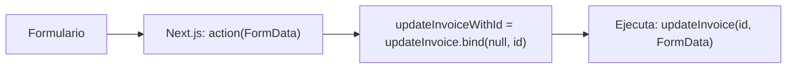

# Uso de .bind() en EditInvoiceForm

El método `.bind()` se utiliza aquí para "pre-configurar" argumentos de una función antes de pasarla como manejador de eventos. Esta técnica es necesaria por las siguientes razones:

## Problema original
- `updateInvoice` necesita 2 parámetros: `(id, formData)`
- Pero el formulario solo pasa automáticamente `formData` al `action`

## Solución con `.bind()`
```typescript
const updateInvoiceWithId = updateInvoice.bind(null, invoice.id);
```
- Crea una nueva función donde:
  - El primer argumento (`id`) ya está fijado como `invoice.id`
  - El segundo argumento (`formData`) lo proveerá Next.js al enviar el formulario

## Alternativas y por qué no usarlas
- ❌ Arrow function: `() => updateInvoice(invoice.id, formData)`
  - Next.js no puede serializar funciones complejas para Server Actions
- ❌ Closure: Similar problemas de serialización
- ✅ `.bind()`: Es la forma que Next.js recomienda para pasar parámetros adicionales

## Flujo completo



## Ejemplo equivalente manual
```typescript
// Versión manual sin .bind()
async function handleSubmit(formData: FormData) {
  return updateInvoice(invoice.id, formData);
}
// Pero esto no funciona bien con Server Actions de Next.js
```

La solución con `.bind()` es:
✔ Compatible con Server Actions  
✔ Mantiene la serialización automática  
✔ Es el patrón recomendado por Next.js  

Si no usaras `.bind()`, tendrías que:
1. Crear un campo hidden en el formulario con el ID
2. O usar un enfoque completamente diferente

Es una solución elegante para un problema específico de cómo Next.js maneja las Server Actions con formularios.