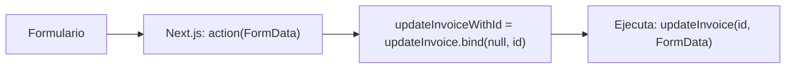

# Uso de .bind() en EditInvoiceForm

## Problema original
- `updateInvoice` necesita 2 parámetros: `(id, formData)`
- Pero el formulario solo pasa automáticamente `formData` al `action`

## Solución con `.bind()`
```typescript
const updateInvoiceWithId = updateInvoice.bind(null, invoice.id);
```
- Crea una nueva función donde:
  - El primer argumento (`id`) ya está fijado como `invoice.id`
  - El segundo argumento (`formData`) lo proveerá Next.js al enviar el formulario

## Explicación técnica
### Sobre el parámetro `null`
El `null` en `.bind(null, invoice.id)` tiene un propósito específico:
1. **Propósito del primer argumento**:
   - Normalmente establece el valor de `this`
   - Como `updateInvoice` es independiente, no necesita contexto (`this`)
   - Por eso usamos `null`

2. **Estructura de `.bind()`**:
```javascript
function.bind(thisArg, arg1, arg2, ...)
```
   - `thisArg`: Contexto (`this`) - `null` aquí
   - `arg1`, `arg2`: Argumentos pre-establecidos (`invoice.id`)

## Alternativas
### ❌ Arrow function
```typescript
() => updateInvoice(invoice.id, formData)
```
- Problemas de serialización con Server Actions
- Next.js no puede serializar closures complejos

### ✅ Alternativa segura (sin `.bind()`)
```typescript
<form action={updateInvoice}>
  <input type="hidden" name="id" value={invoice.id} />
</form>
```

## Ejemplos prácticos
### Ejemplo básico
```typescript
// Función original
function updateInvoice(id: string, formData: FormData) {
  // lógica...
}

// Uso con bind
const boundFn = updateInvoice.bind(null, '123');
boundFn(formData); // Equivale a updateInvoice('123', formData)
```

### Flujo completo


## Conclusión
La solución con `.bind()` es:
✔ Compatible con Server Actions
✔ Mantiene serialización automática
✔ Patrón recomendado por Next.js